# Steps for Windows Hardning

**A) Setting Hostname**

**1) Method 1: Using the GUI**

Open Server Manager:

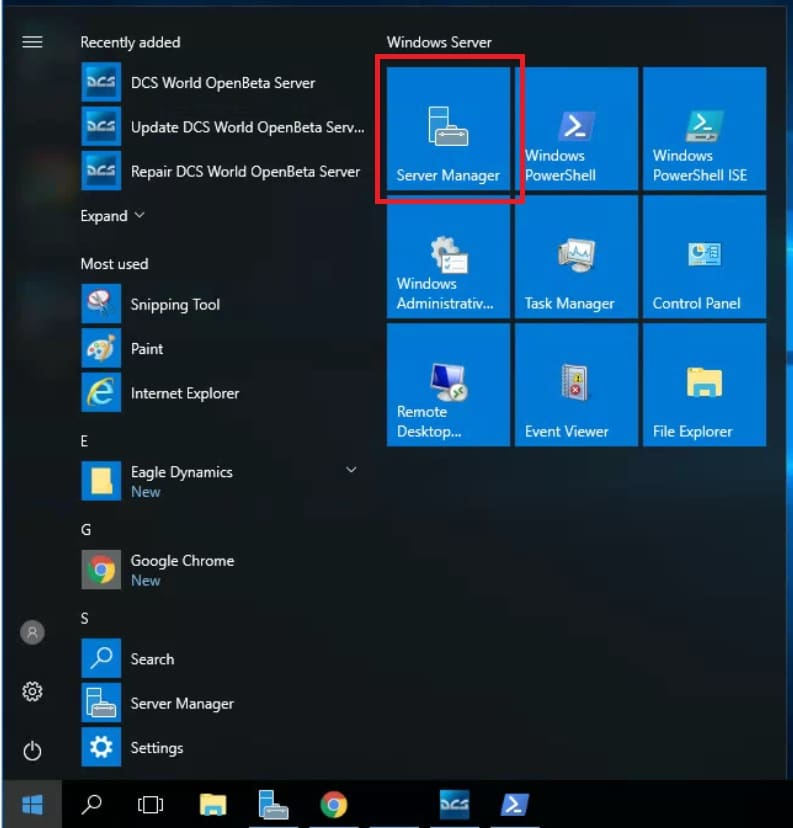{: style="height:600px;width:500px"}

  
Click on the ‘Local Server’ from the left sidebar menu and click on the ‘Computer name’.:

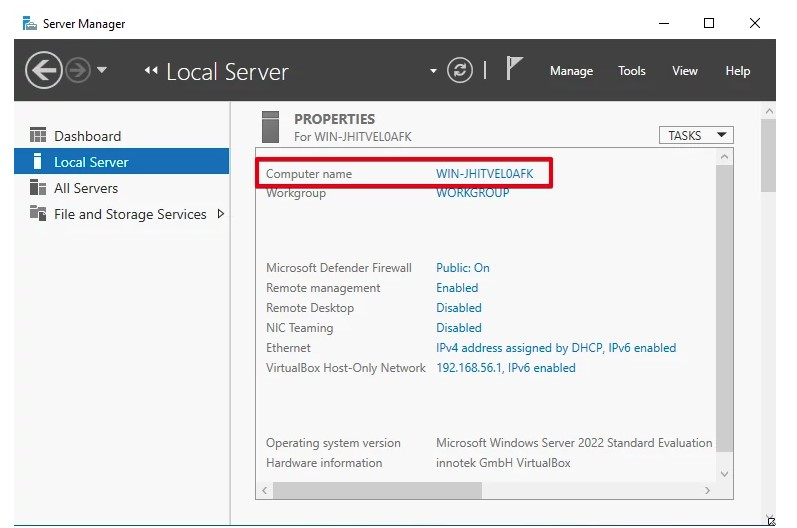{: style="height:600px;width:750px;border:2px solid black;"}

  
The <b>‘System Properties’</b> dialog appears on the screen. Click on the <b>‘Change’</b> button in the ‘Computer Name’ tab.

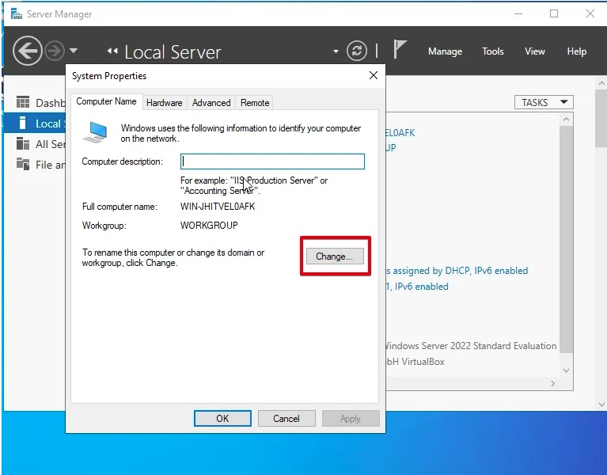{: style="height:600px;width:750px;border:2px solid black;"}

  
Enter the server name in the ‘Computer name’ field that you want to use as a server name.

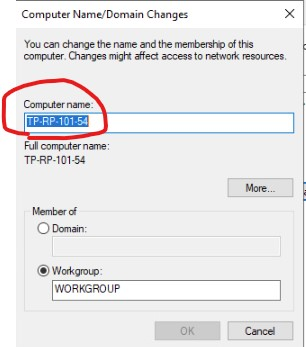{: style="height:500px;width:400px;border:2px solid black;"}

OK , SAVE , Restart Computer and its Done

Assign Ip Address to required interfaces  
`press WIN+R and type ncpa.cpl and hit ok`

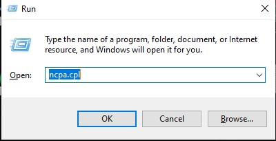{: style="height:400px;width:600px;border:2px solid black;"}
  

identify interfaces to assign ip address, like below and double clik on it  

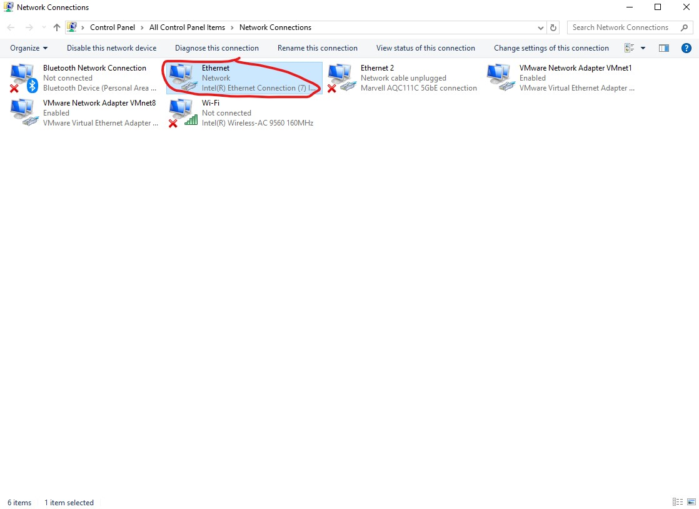{: style="height:500px;width:800px;border:2px solid black;"}

  
On double click you will  get below like dialog box ,click on Properties  

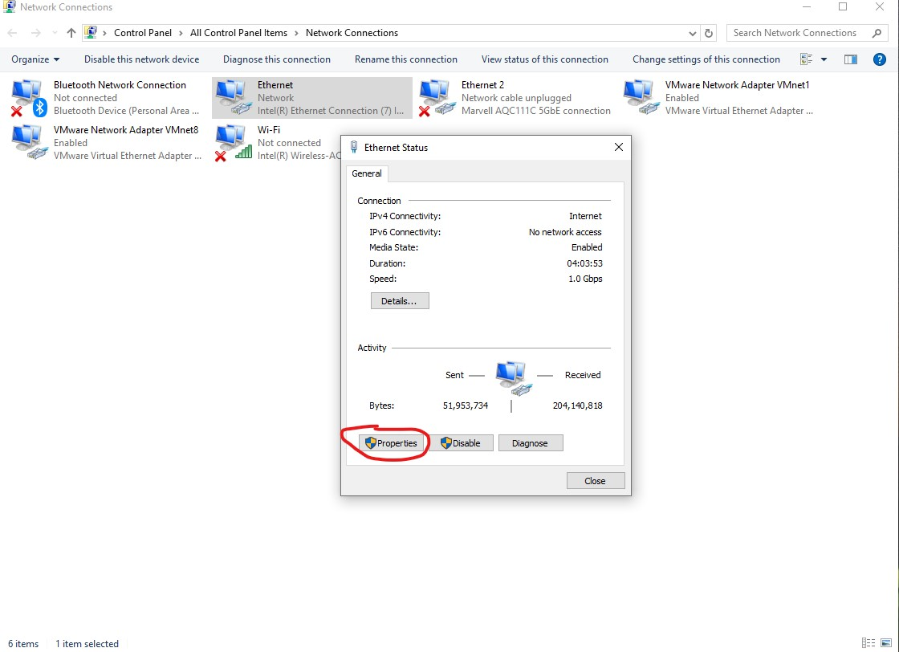{: style="height:500px;width:800px;border:2px solid black;"}

  
 After click on Properties you will  get below like dialog box , now double click on internet protocol version 4 

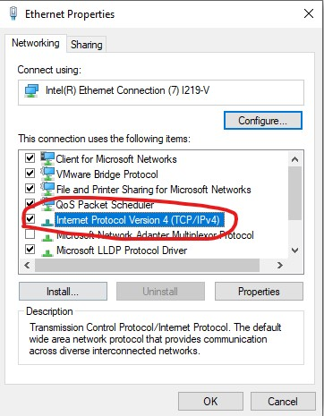{: style="height:600px;width:500px;border:2px solid black;"}

  
 select on red mark and insert your ip and click on save . 

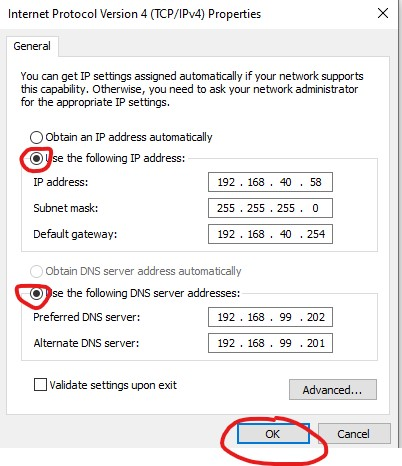{: style="height:600px;width:500px;border:2px solid black;"}

  
 Check Partitions as per requirnment. 

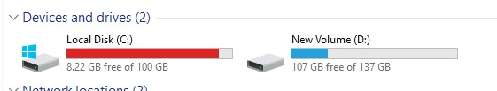{: style="height:100px;width:500px;border:2px solid black;"}

  
 Check for updates. 
go to the seach bar and type update and select check for updates.

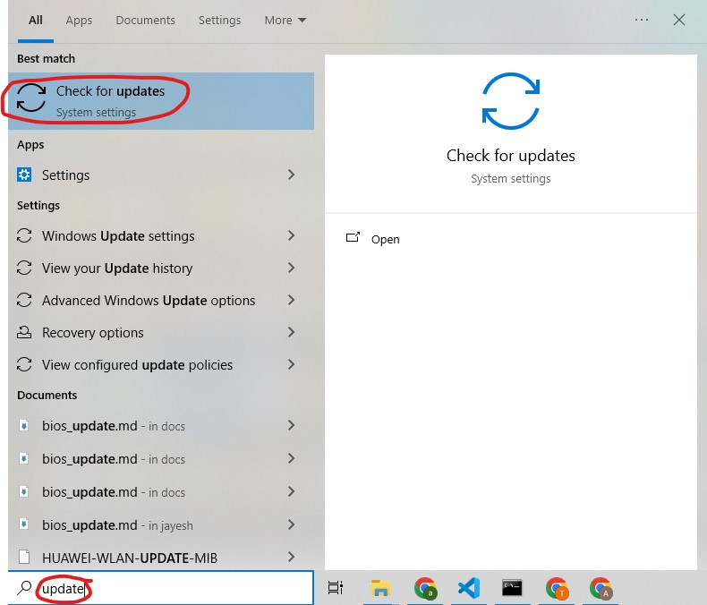{: style="height:500px;width:600px;border:2px solid black;"}
  
<b>Clik on check fo rupdates , until you got below message , You are Update!!!<b> 

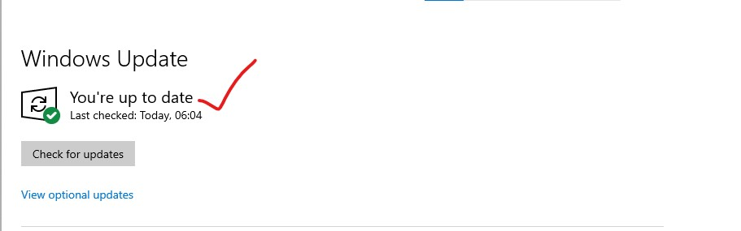{: style="height:200px;width:600px;border:2px solid black;"}
 

  
 Power Setting 
 
Go to search bar and type Control Panel and clik on it.  
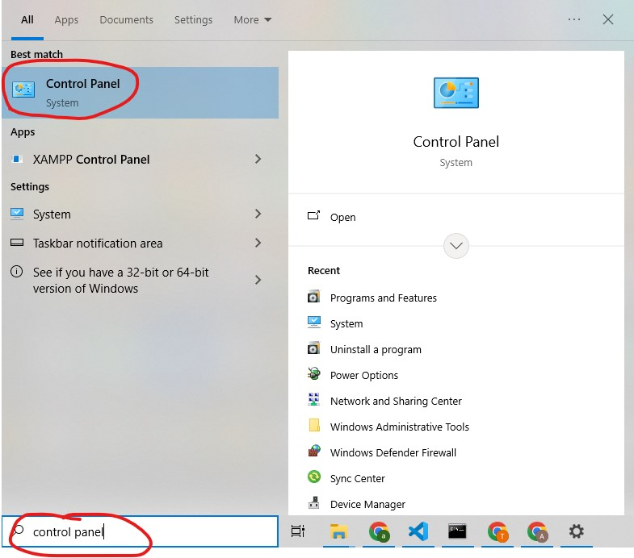{: style="height:500px;width:600px;border:2px solid black;"}

 
Now Clik on category and select small icons.
 
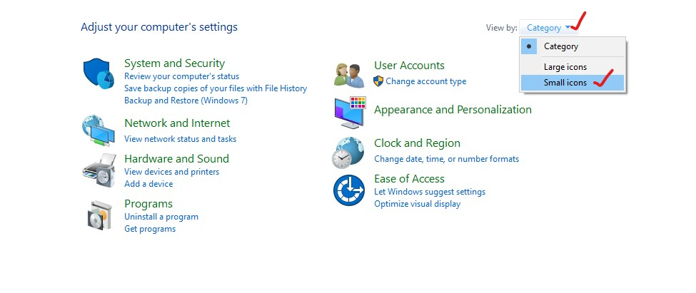{: style="height:400px;width:750px;border:2px solid black;"}

 
Now Clik on Power Option.
 
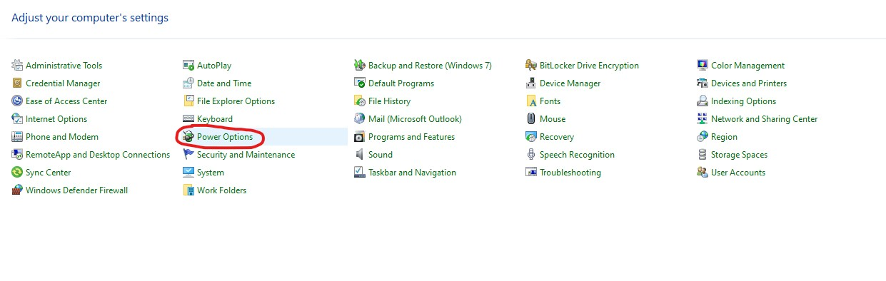{: style="height:400px;width:1000px;border:2px solid black;"}

 
By default Balanced (recommonded) is selected. 
Click on Change plan setting.
 
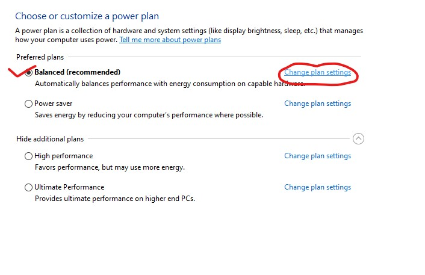{: style="height:500px;width:700px;border:2px solid black;"}

 
A new windows will open , Set both setting as Never and click on Save changes.
 
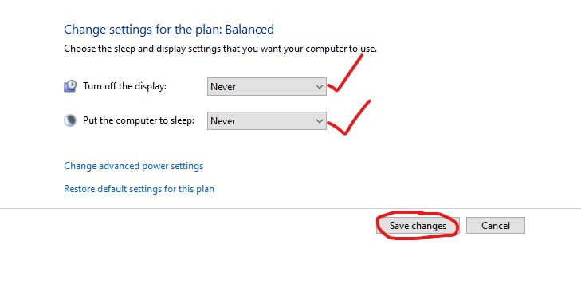{: style="height:400px;width:600px;border:2px solid black;"}

 
Now Click on Change plan setting as shown below picture. 
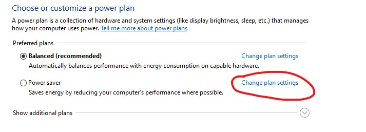{: style="height:400px;width:800px;border:2px solid black;"}
 
A new windows will open , Set both setting as Never and click on Save changes.
 
{: style="height:400px;width:600px;border:2px solid black;"}

 
Now click on arrow as show in picture 
 
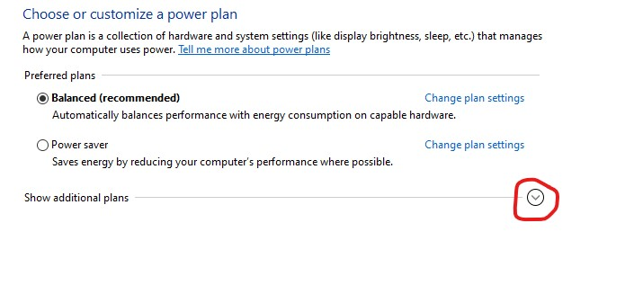{: style="height:400px;width:700px;border:2px solid black;"}

 
Select change setting 
 
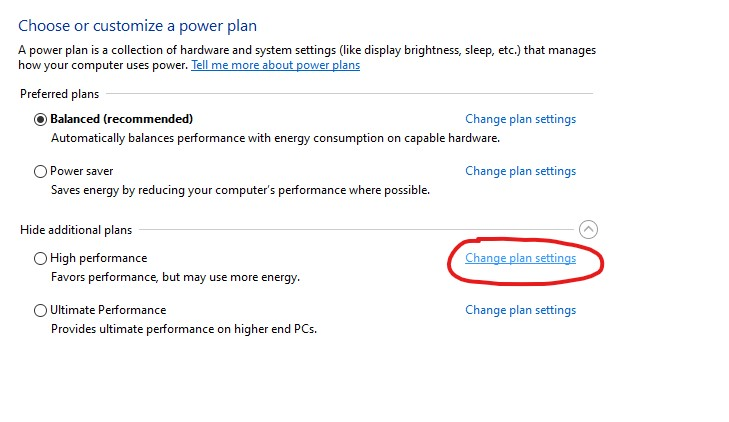{: style="height:400px;width:700px;border:2px solid black;"}

 
A new windows will open , Set both setting as Never and click on Save changes.
 
{: style="height:400px;width:600px;border:2px solid black;"}

 
Select change setting 
 
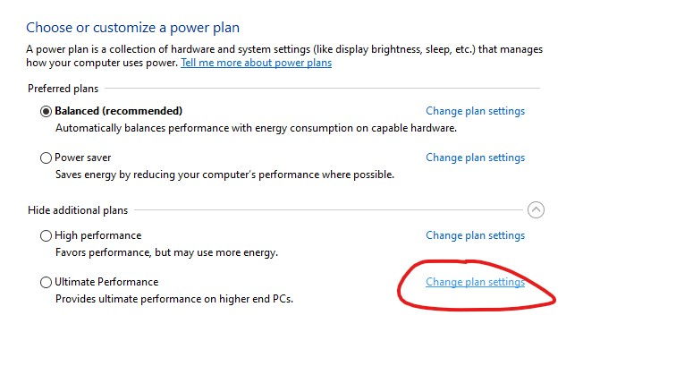{: style="height:400px;width:700px;border:2px solid black;"}

 
A new windows will open , Set both setting as Never and click on Save changes.
 
{: style="height:400px;width:600px;border:2px solid black;"}

 

 Disallow users from turning on/off windows firewall
  
Go to the run and type `gpedit.msc` and hit ok. 
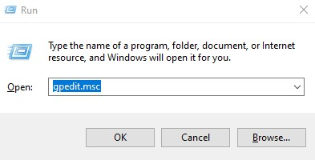{: style="height:300px;width:600px;border:2px solid black;"}
  
 Nevigate to the `Computer Configuration --> Administrative Templates --> Network --> Network Connections --> Windows Firewall --> Standard Profile` 
 Refer below screenshot.
  
 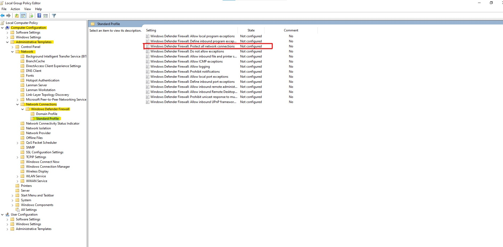{: style="height:800px;width:1600px;border:2px solid black;"} 
  
 Double click on `Windows Defender Firewall: Protect all network connections` it will open new windows like below.
  Select `Enable ` button and then `Apply`then`Ok`  
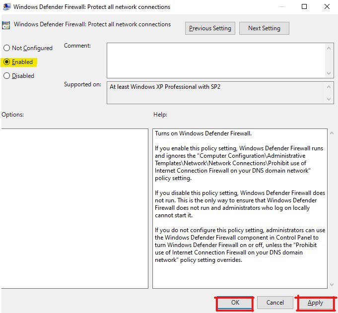{: style="height:500px;width:600px;border:2px solid black;"}  
 

 
 Digitally sign communications (always) 
 

Go to the run and type `gpedit.msc` and hit ok.

 
{: style="height:300px;width:600px;border:2px solid black;"} 
 Nevigate to path `Computer Configuration\Windows Settings\Security Settings\Local Policies\Security Options`
Refer below screen
 
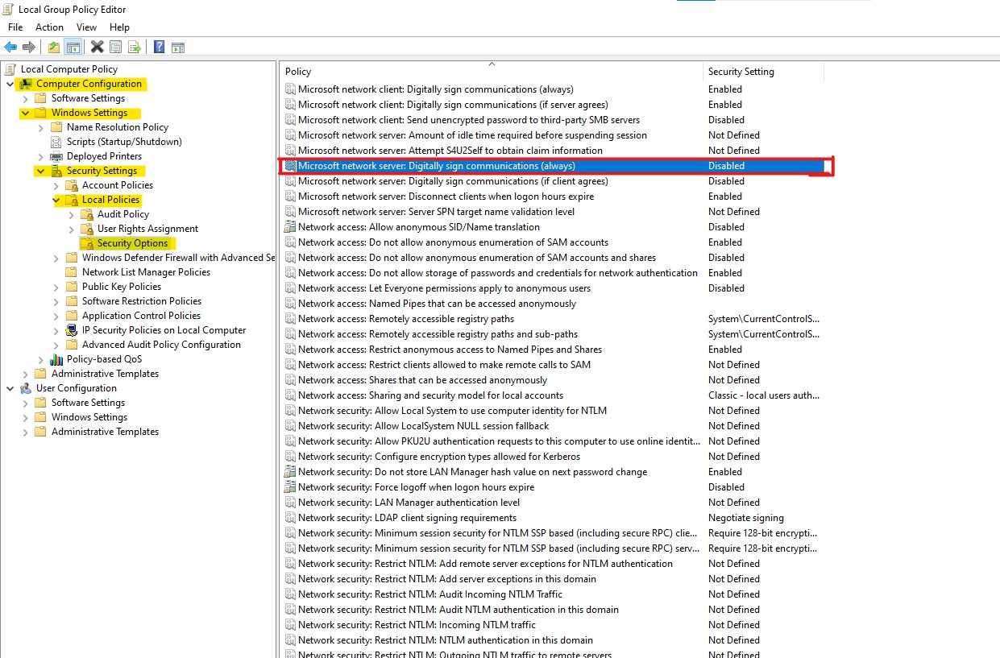{: style="height:800px;width:1200px;border:2px solid black;"} 
 
Double click on `Microsoft network server: Digitally sign communications (always)` By default its disabled , make it enable `Apply` then `OK.` 

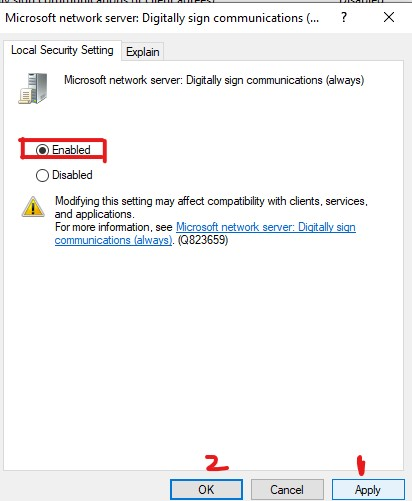{: style="height:500px;width:400px;border:2px solid black;"} 

 
 Enable the virtualization based security  
 

Go to the run and type `gpedit.msc` and hit ok.
 

{: style="height:300px;width:600px;border:2px solid black;"}

 
Nevigate to path `Computer Configuration > Administrative Templates > System > Device Guard.`
Click on Device Guard and on right side you will see `Turn On virtualisation Based Security.`
By default its Not Configured. See below image.
 

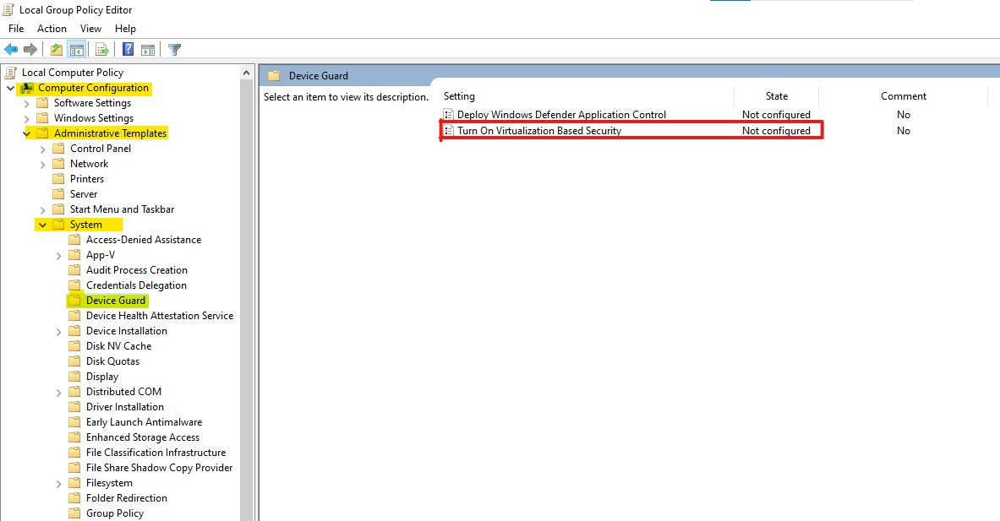{: style="height:500px;width:950px;border:2px solid black;"}
 
 
Click on `Turn On virtualisation Based Security.` and  select `Enable` then `Apply` and `OK`
 
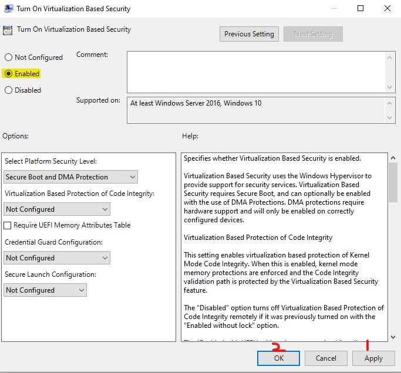{: style="height:700px;width:700px;border:2px solid black;"}

 

 